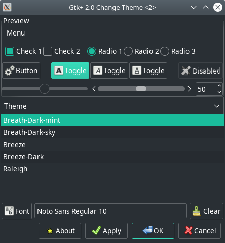
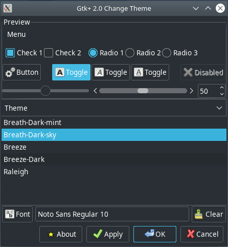

# gtk-theme-breath

GTK theme forked from [breeze-gtk](https://quickgit.kde.org/?p=breeze-gtk.git) to match the colors of Plasma 5 maia theme

GTK2 theme made by [scionicspectre](https://github.com/scionicspectre/BreezyGTK), and colors changed too.

The dark theme is not ported. And won't be installed.

## Breath-Dark theme

This GTK theme forked from [artwork-breath-gtk](https://github.com/manjaro/artwork-breath-gtk) to bring more colors: blue (BreathDark-sky) and red (BreathDark-rage).

Original BreathDark was renamed to BreathDark-mint to avoid confusion.

### Examples






### How It's Made

#### Assets

ImageMagick was used to change the colors of theme elements in ```/assets```:

```bash
$ for f in ./*.png; do convert $f -fuzz 30% -fill '#46BCE4FF' -opaque '#1ABC9CFF' $f; done
```

where ```#46BCE4FF``` -- base color of BreathDark-sky theme (in RGBA), ```#1ABC9CFF``` -- color we want to change (in RGBA).


#### CSS


# Requirements

- GTK+ 3.16
- Pixmap/Pixbuf theme engine for GTK 2

# Install instructions
If your distribution doesn't provide a package, you can install the theme system-wide by copying it to the appropriate directory, usually "/usr/share/themes".
```bash
$ find Breath-gtk -type f -exec install -Dm644 '{}' "$pkgdir/usr/share/themes/{}" \;
```

To install only for the current user, copy the files to "~/.themes".

To set the theme in Plasma 5, install kde-gtk-config and use System Settings > Application Style > GNOME Application Style.
Also make sure to disable "apply colors to non-Qt applications" in System Settings > Colors > Options.
